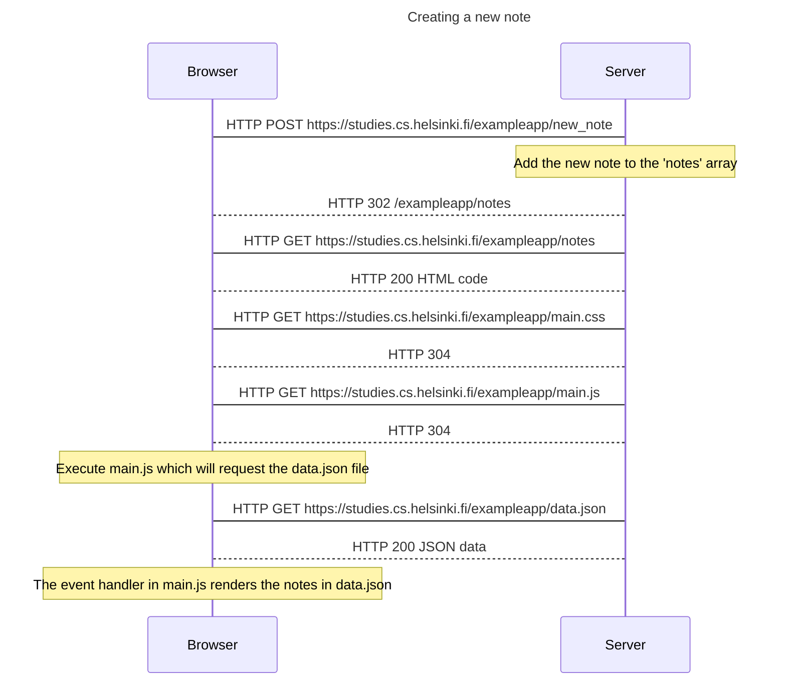
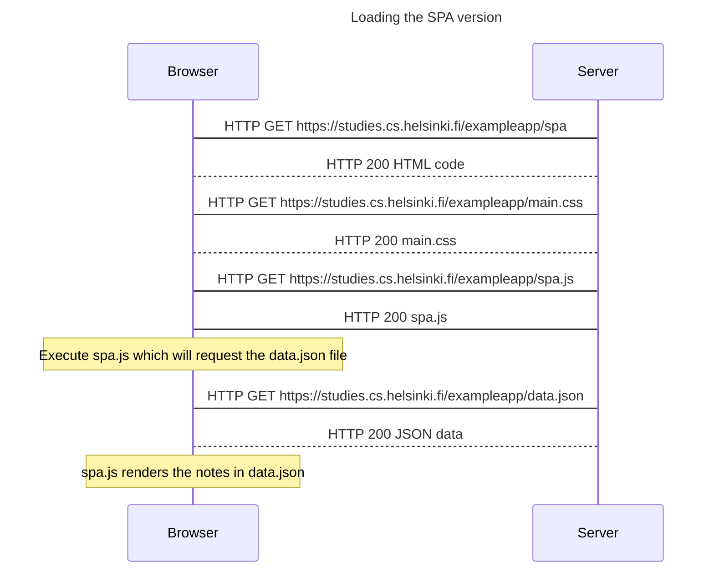
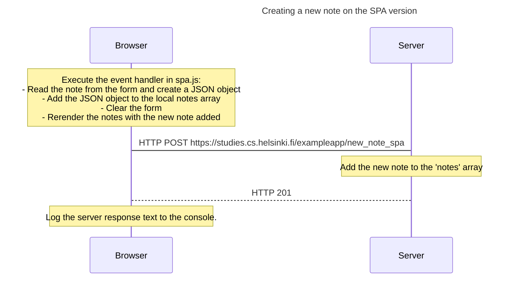

# Part 0 - Fundamentals of Web apps

## Exercises
- [x] 0.1 HTML  
- [x] 0.2 CSS  
- [x] 0.3 HTML forms
- [x] 0.4 [New note diagram](#exercise-04)
- [x] 0.5 [Single page app diagram](#exercise-05)
- [x] 0.6 [New note in Single page app diagram](#exercise-06)

### Exercise 0.4

### Exercise 0.5

### Exercise 0.6

